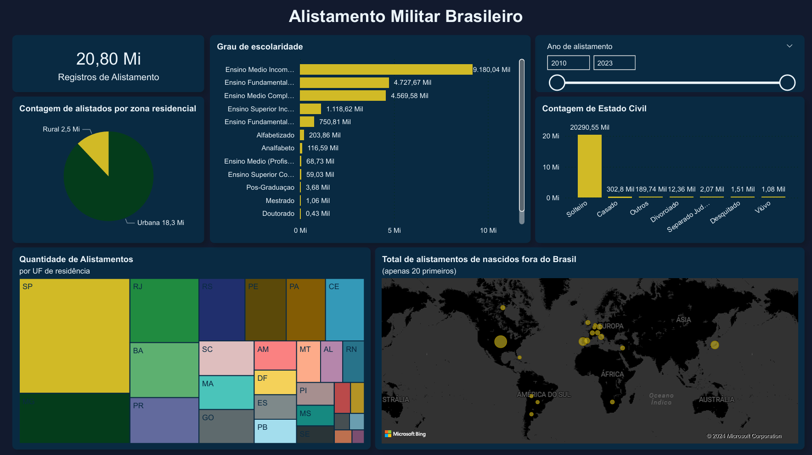

O objetivo deste projeto é fazer uma análise dos dados acerca do alistamento militar brasileiro a partir do ano de 2010 até a atualidade. Os dados foram obtidos através do [portal de dados abertos](https://dados.gov.br/home) do governo brasileiro.

Por conta da grande quantidade de registros (mais de 20 milhões), os arquivos contidos nas camadas raw, silver e gold não foram comitados.

O dashboard obtido através da análise dos dados pode ser observado abaixo:

